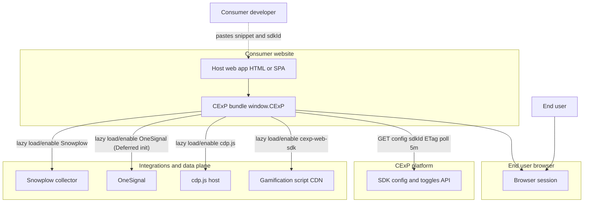
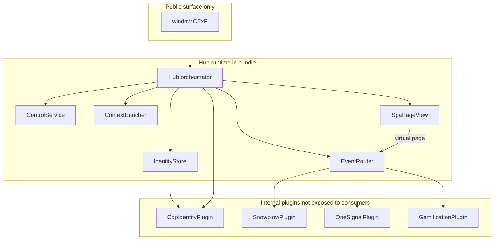
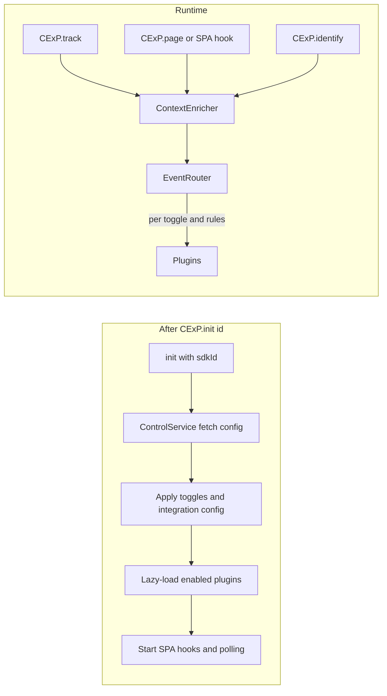
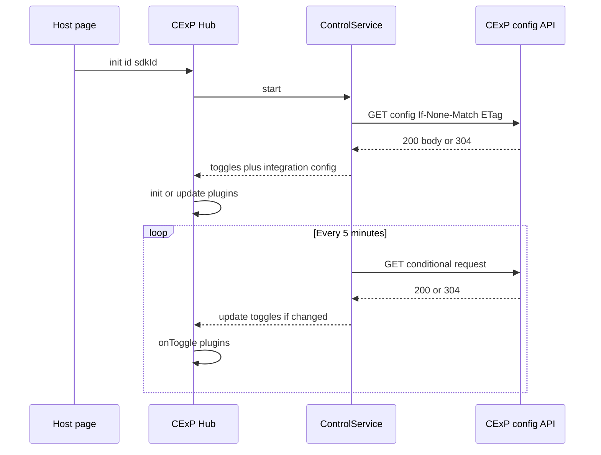
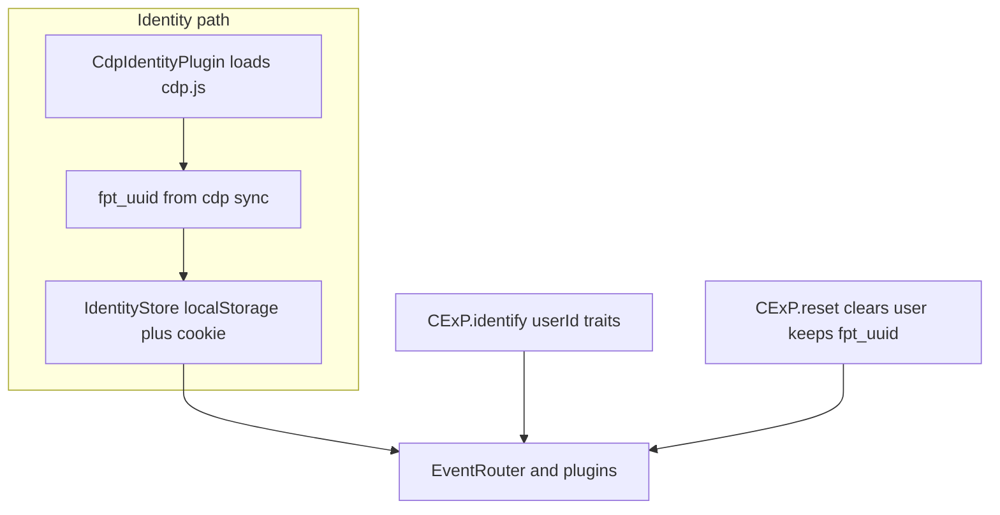
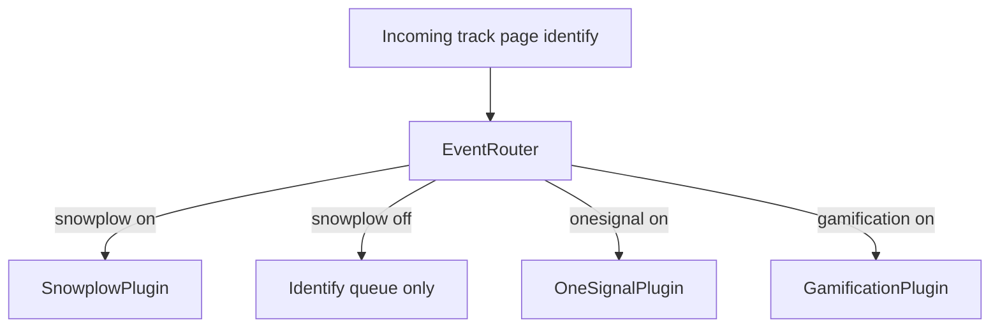

# CExP Hub SDK — system architecture

This document reflects the architecture described in the implementation plan: [../plans/2026-03-20-cexp-hub-sdk.md](../plans/2026-03-20-cexp-hub-sdk.md).

Diagrams use [Mermaid](https://mermaid.js.org/); render in GitHub, VS Code (preview), or any Mermaid-compatible viewer.

---

## Integration philosophy (integrate once, never touch script again)

Consumers embed a single stable CDN script snippet (e.g. `window.CExP`) one time. After that, toggles and integration behavior are driven by your backend (control/toggle polling), and the SDK injects vendor scripts lazily per integration. This lets your platform evolve without forcing consumers to update their snippet.

## 1. System context (who talks to whom)

Actors: **Consumer** (developer who embeds the script), **End user** (browser visitor), **CExP backend** (your config/toggles), **third-party / in-house services**.



---

## 2. Logical containers inside the browser

Single **hub process** in the page: public API is only `CExP`; plugins are internal.



---

## 3. Request and event flow (high level)



### OneSignal deferred embed (used internally)

When `onesignal.enabled` is true, the hub injects the OneSignal script and performs deferred initialization using the pattern below (consumer never touches OneSignal vendor globals):

```html
<script
  src="https://cdn.onesignal.com/sdks/web/v16/OneSignalSDK.page.js"
  defer
></script>
<script>
  window.OneSignalDeferred = window.OneSignalDeferred || [];
  OneSignalDeferred.push(async function (OneSignal) {
    await OneSignal.init({
      appId: `${onesignal_app_id}`,
    });
  });
</script>
```

---

## 4. Control and toggle loop



---

## 5. Identity and anonymous id (`fpt_uuid`)



---

## 6. Event routing rules (plan snapshot)

| Integration | Toggle off behavior (planned) |
|---------------|-------------------------------|
| Snowplow | Queue **identify** only; drop **track** and **page** |
| OneSignal | Clear user or subscription association per vendor API |
| Gamification | Drop gamification-bound calls; script loaded when enabled (lazy) |
| Identity | Drives `fpt_uuid`; storage localStorage plus cookie fallback |



---

## Related

- Implementation tasks and file layout: [../plans/2026-03-20-cexp-hub-sdk.md](../plans/2026-03-20-cexp-hub-sdk.md)
