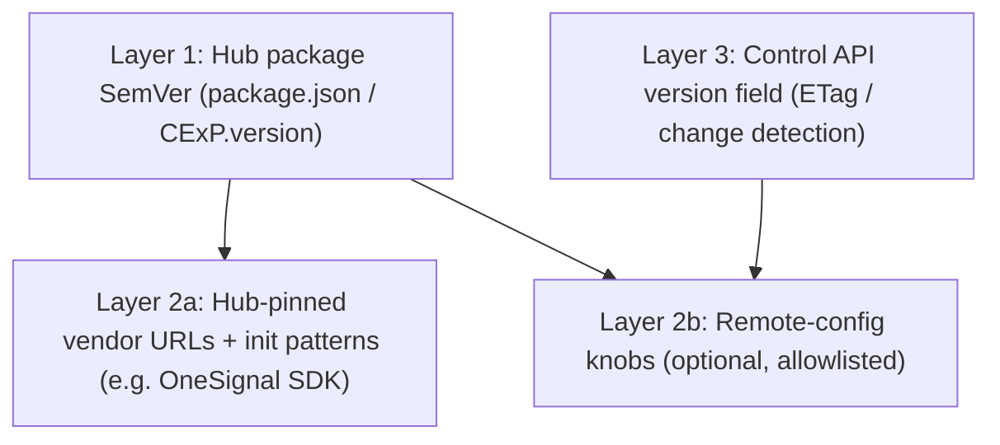
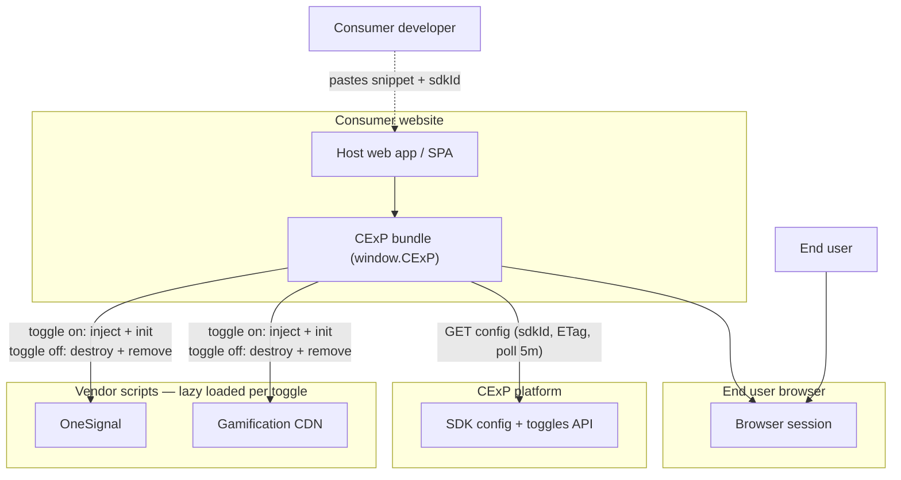
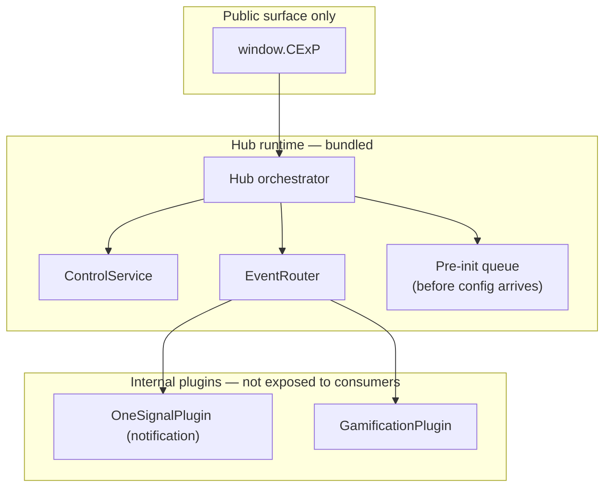
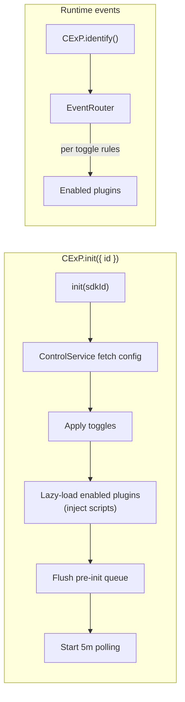
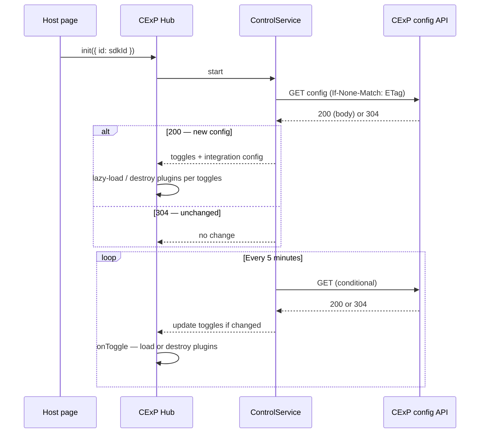
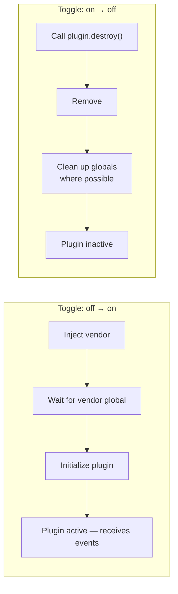
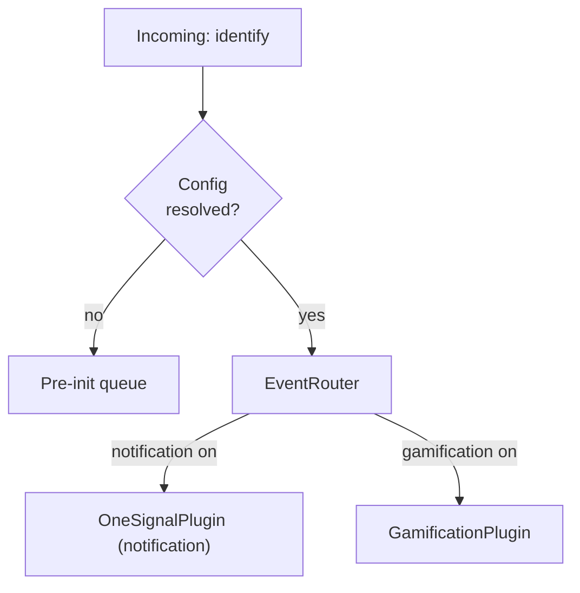

# CExP Hub SDK — system architecture

> **Current as of 2026-04:** Runtime behavior is a **two-integration** hub (**notification** via OneSignal, **gamification**) behind `window.CExP`. The public API surface is `init`, `identify`, `reset`, and `version`. **Identity (cdp.js), Snowplow, `IdentityStore`, automatic SPA history listeners, `track`, and `page`** were removed — see [../plans/2026-04-03-remove-identity-snowplow-plugins.md](../plans/2026-04-03-remove-identity-snowplow-plugins.md) and [../plans/2026-04-07-plugin-cleanup-and-notification-rename.md](../plans/2026-04-07-plugin-cleanup-and-notification-rename.md).

The older four-plugin design (identity + Snowplow + OneSignal + gamification) is documented historically in [../plans/2026-03-20-cexp-hub-sdk.md](../plans/2026-03-20-cexp-hub-sdk.md); treat that plan as **superseded** for current product behavior.

Diagrams use [Mermaid](https://mermaid.js.org/); render in GitHub, VS Code (preview), or any Mermaid-compatible viewer.

---

## Integration philosophy

**Integrate once, never touch script again.** Consumers embed a single stable CDN script snippet one time. After that, toggles and integration behavior are driven by your backend (control/toggle polling), and the SDK injects/removes vendor scripts lazily per integration.

**Two integrations have toggles.** **Notification** (OneSignal) and **gamification** are independently togglable from the backend config. When toggled on, the vendor script is lazy-loaded and initialized. When toggled off, the plugin is destroyed and its `<script>` tag is **removed from the DOM**.

There is **no** `track` or `page` on the public API. Consumers call `CExP.identify()` to associate the session with a known user and `CExP.reset()` to clear state.

---

## Version management (hybrid)

This SDK follows a **hybrid** version-management policy (design spec: [../specs/2026-03-30-version-management-design.md](../specs/2026-03-30-version-management-design.md)):

- **Layer 1 — Hub package SemVer**: `cexp-hub-sdk` releases (npm / CDN) represent the **public `CExP` API** and hub behavior compatibility.
- **Layer 2 — Vendor pins (hybrid split)**:
  - **Hub-pinned (default)**: sensitive integrations (script hosts/paths, init patterns) are fixed in hub code and only change via hub release (e.g. OneSignal SDK URL).
  - **Remote-config knobs (allowlisted)**: explicitly supported, validated fields may be overridden by control JSON without a hub release (e.g. gamification `packageVersion`, `apiKey`), with hub defaults as fallback.
- **Layer 3 — Control API `version` field**: the config payload `version` is for **change detection / identity** (often paired with ETag), **not** npm SemVer.

### Version layers (stack)




### Hub release vs backend-only change

```mermaid
flowchart TD
  Q[Vendor or integration change]
  Q --> H{Breaking API, new script host/path,\nor hub logic change?}
  H -->|Yes| R1[New cexp-hub-sdk release + CI + deploy npm/CDN]
  H -->|No| Q2{Only safe remote fields\n(e.g. allowlisted gamification semver)?}
  Q2 -->|Yes + wired| R2[Update control API config for sdkId\n(optional; no hub release)]
  Q2 -->|No / not wired| R1
```


---

## 1. Key integration details


| Integration    | Script source                                                   | Global                    | Hub role                                                       | Versioning policy                                                |
| -------------- | --------------------------------------------------------------- | ------------------------- | -------------------------------------------------------------- | ---------------------------------------------------------------- |
| Notification   | `cdn.onesignal.com/.../OneSignalSDK.page.js`                    | `OneSignalDeferred` queue | Web push; `identify` maps to vendor login where supported.     | **Hub-pinned** (URL/init via hub release)                        |
| Gamification   | `cdn.jsdelivr.net/npm/cexp-gamification@…/dist/cexp-web-sdk.js` | `window.cexp`             | `identify` hook when enabled; CDP JWT token refresh on enable. | **Hybrid** (hub defaults; optional allowlisted remote overrides) |


---

## 2. System context (who talks to whom)




---

## 3. Logical containers inside the browser

Single hub process in the page. Public API is only `CExP`; plugins are internal.




---

## 4. Request and event flow




### Pre-init queue

Calls made before the first config fetch completes are held in a queue. Once config arrives and plugins are initialized, the queue is flushed through the EventRouter in FIFO order. No events are dropped during init.

---

## 5. Control and toggle loop




### Control API `version` (config identity)

The control JSON `version` value is treated as **config identity / change detection** (usually paired with ETag). It is **not** the hub package SemVer; hub SemVer remains `cexp-hub-sdk`'s published version.

---

## 6. Toggle lifecycle

When a plugin's toggle transitions, the hub performs:




---

## 7. Event routing rules (current)


| Integration      | Toggle on                                                    | Toggle off                                       |
| ---------------- | ------------------------------------------------------------ | ------------------------------------------------ |
| **Notification** | `identify` → associate user; push flow per vendor SDK        | Clear user/subscription; script removed from DOM |
| **Gamification** | `identify` forwarded when hook exists; CDP JWT token refresh | Calls ignored; script removed from DOM           |





- **`identify`:** Notification and gamification (each when enabled).
- **`reset`:** Notification only (when enabled).

---

## Related

- Historical implementation plan (four plugins): [../plans/2026-03-20-cexp-hub-sdk.md](../plans/2026-03-20-cexp-hub-sdk.md)
- Removal of identity + Snowplow + SPA stack: [../plans/2026-04-03-remove-identity-snowplow-plugins.md](../plans/2026-04-03-remove-identity-snowplow-plugins.md)
- Plugin cleanup + notification rename: [../plans/2026-04-07-plugin-cleanup-and-notification-rename.md](../plans/2026-04-07-plugin-cleanup-and-notification-rename.md)
- Version-management policy (hybrid): [../specs/2026-03-30-version-management-design.md](../specs/2026-03-30-version-management-design.md)
