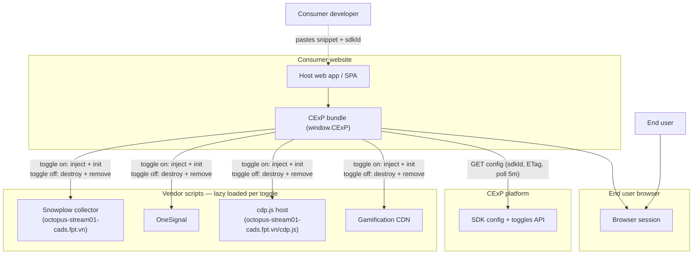
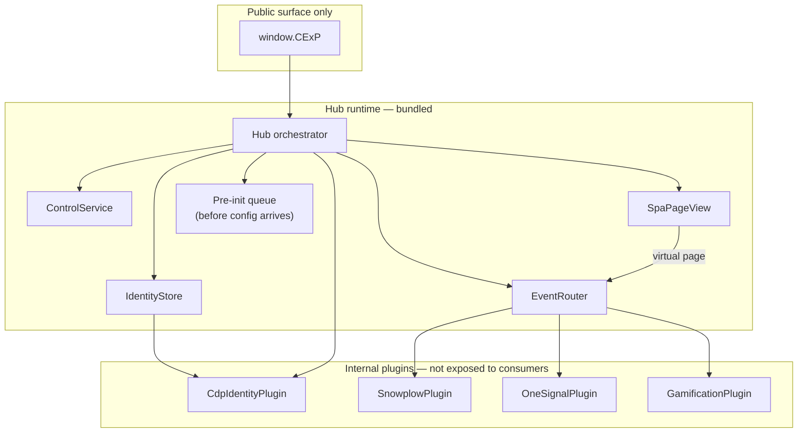
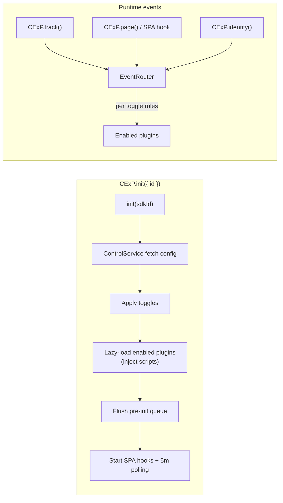
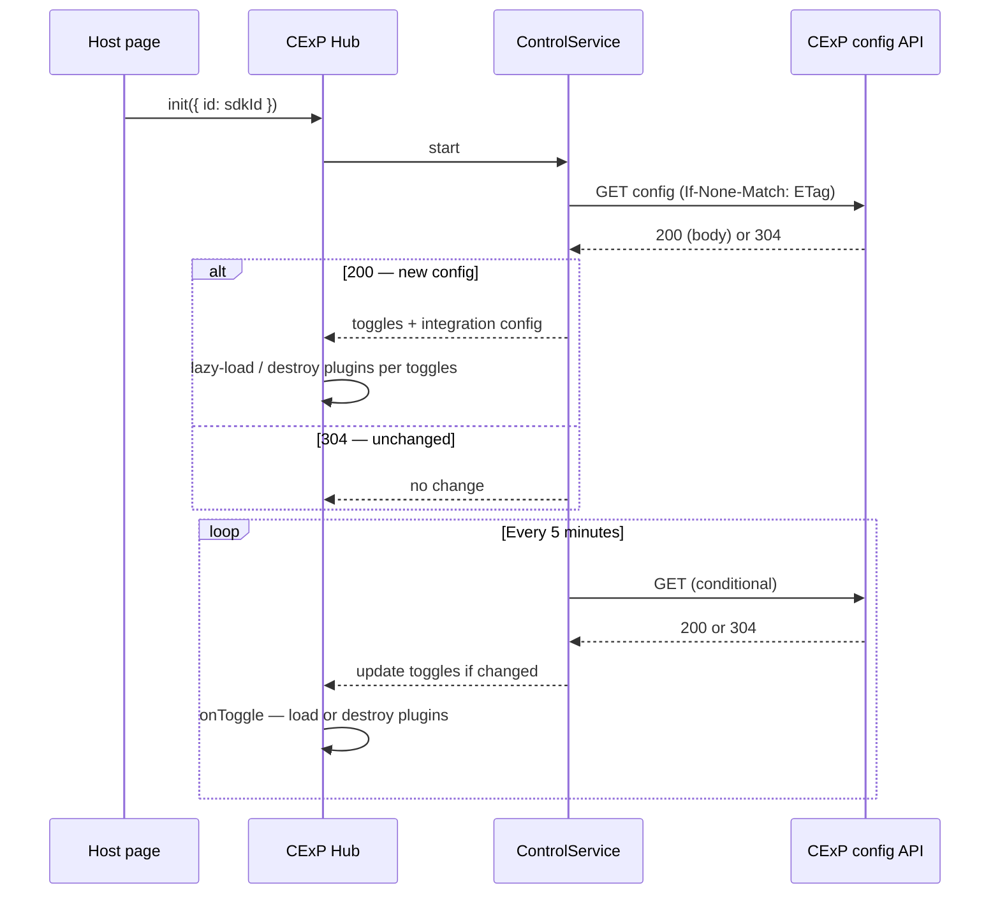
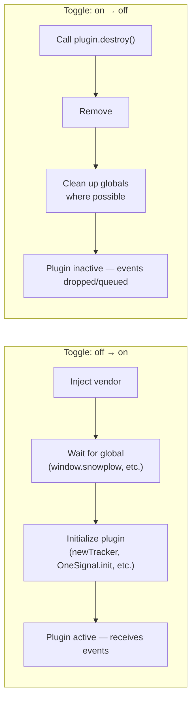
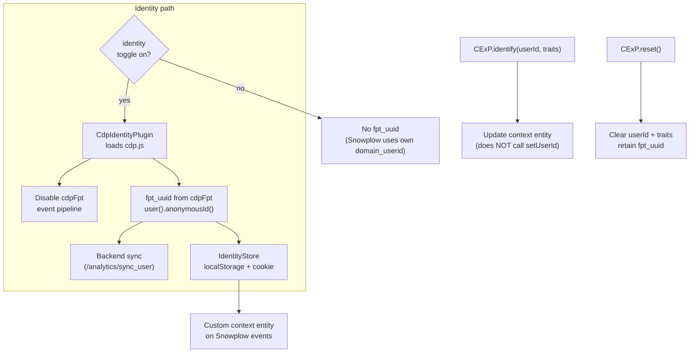
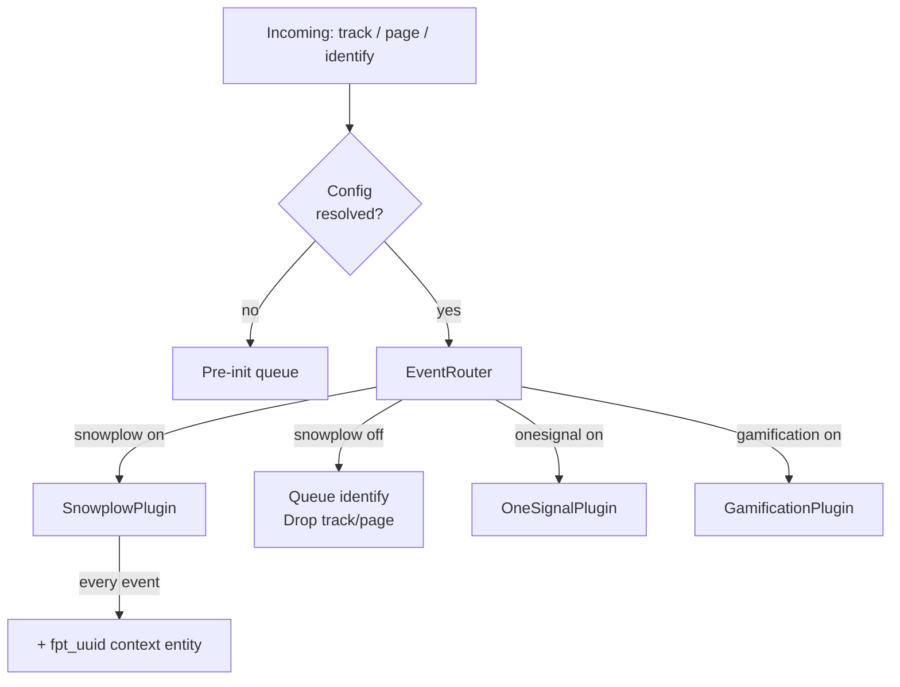
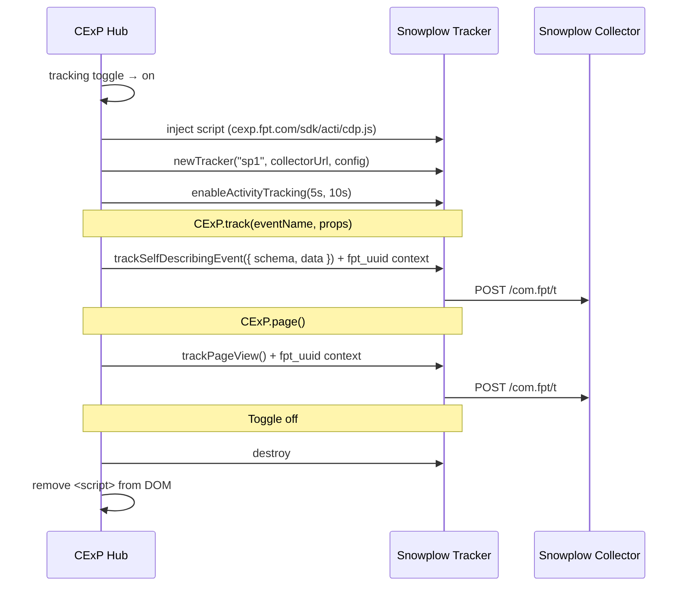

# CExP Hub SDK — system architecture

This document reflects the architecture described in the implementation plan: [../plans/2026-03-20-cexp-hub-sdk.md](../plans/2026-03-20-cexp-hub-sdk.md).

Diagrams use [Mermaid](https://mermaid.js.org/); render in GitHub, VS Code (preview), or any Mermaid-compatible viewer.

---

## Integration philosophy

**Integrate once, never touch script again.** Consumers embed a single stable CDN script snippet one time. After that, toggles and integration behavior are driven by your backend (control/toggle polling), and the SDK injects/removes vendor scripts lazily per integration. This lets your platform evolve without forcing consumers to update their snippet.

**All four integrations have toggles.** Identity (cdp.js), tracking (Snowplow), notifications (OneSignal), and gamification are each independently togglable from the backend config. When toggled on, the vendor script is lazy-loaded and initialized. When toggled off, the plugin is destroyed and its `<script>` tag is **removed from the DOM**.

---

## 1. Key integration details

| Integration | Script source | Global | Hub role |
| --- | --- | --- | --- |
| Identity | `octopus-stream01-cads.fpt.vn/cdp.js` | `window.cdpFpt` | Segment Analytics.js fork. **Identity only** — `fpt_uuid` management, cross-domain sync. Event pipeline disabled. |
| Tracking | `cexp.fpt.com/sdk/acti/cdp.js` | `window.snowplow` | Self-hosted Snowplow sp.js tracker. All event capture: `trackSelfDescribingEvent`, `trackPageView`, `enableActivityTracking`. |
| Notifications | `cdn.onesignal.com/.../OneSignalSDK.page.js` | `window.OneSignalDeferred` | Web push via OneSignalDeferred init pattern. |
| Gamification | `cdn.jsdelivr.net/.../cexp-web-sdk.js` | `window.cexp` | In-house gamification. `new window.cexp({ apiKey })` + `init()`. |

---

## 2. System context (who talks to whom)



---

## 3. Logical containers inside the browser

Single hub process in the page. Public API is only `CExP`; plugins are internal.



---

## 4. Request and event flow



### Pre-init queue

Calls made before the first config fetch completes are held in a queue. Once config arrives and plugins are initialized, the queue is flushed through the EventRouter in FIFO order. No events are dropped during init.

---

## 5. Control and toggle loop



---

## 6. Toggle lifecycle

When a plugin's toggle transitions, the hub performs:



---

## 7. Identity and anonymous id (`fpt_uuid`)

`cdp.js` (`window.cdpFpt`) is a **Segment Analytics.js 3.x fork** used exclusively as an identity layer. Its event pipeline (sends to `/analytics/t`, `/p`, `/i`) is **disabled** by the hub — only the user/identity API is used.



### Custom context entity (attached to Snowplow events)

When both identity and Snowplow are enabled, every Snowplow event carries:

```json
{
  "schema": "iglu:com.fpt/cexp_identity/jsonschema/1-0-0",
  "data": {
    "fpt_uuid": "<from IdentityStore>",
    "userId": "<from CExP.identify, or null>",
    "traits": {}
  }
}
```

`CExP.identify(userId, traits)` does **not** call Snowplow's `setUserId()`. The business user identity is only passed through this custom context entity.

---

## 8. Event routing rules

| Integration | Toggle on | Toggle off |
| --- | --- | --- |
| **Identity** | `cdp.js` loaded; `fpt_uuid` generated, synced, stored | `cdp.js` not loaded; script removed from DOM; no `fpt_uuid` |
| **Snowplow** | `track` → `trackSelfDescribingEvent`; `page` → `trackPageView`; `identify` → update context entity | **Queue `identify`** (max 50, 30 min TTL); **drop** `track` + `page`; script removed from DOM |
| **OneSignal** | `identify` → associate user; push subscriptions active | Clear user/subscription; script removed from DOM |
| **Gamification** | `track`/`identify` forwarded to SDK | Drop all calls; script removed from DOM |



---

## 9. Snowplow integration details

The Snowplow tracker is self-hosted. The hub injects and configures it when the tracking toggle is enabled.



---

## Related

- Implementation tasks and file layout: [../plans/2026-03-20-cexp-hub-sdk.md](../plans/2026-03-20-cexp-hub-sdk.md)
