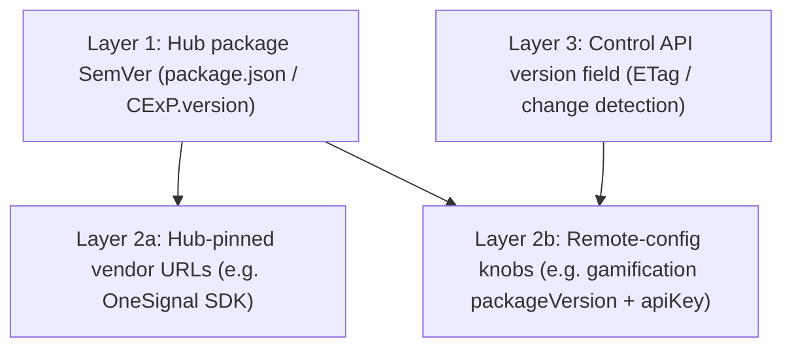
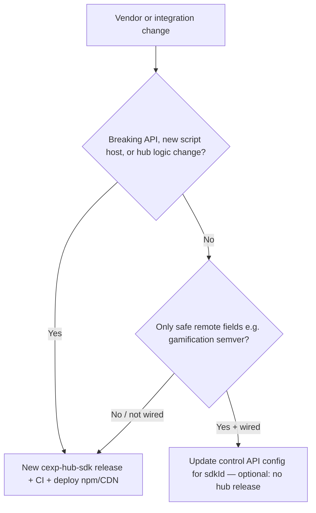
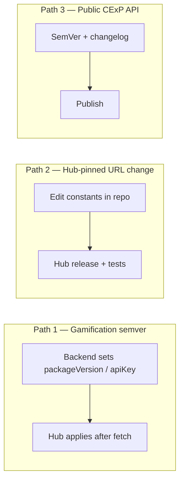

# Version management — design (hybrid)

**Status:** Draft for review  
**Related:** [../architecture/2026-03-20-cexp-hub-sdk-system-architecture.md](../architecture/2026-03-20-cexp-hub-sdk-system-architecture.md) (current hub); [../plans/2026-03-20-cexp-hub-sdk.md](../plans/2026-03-20-cexp-hub-sdk.md) (historical four-plugin plan)

---

## Goal

Define a **best-practice, hybrid** policy for:

1. `**cexp-hub-sdk` releases** (npm / CDN SemVer).
2. **Vendor script / package versions** (OneSignal SDK, gamification `cexp-gamification`, etc.).

The policy must preserve **integrate once (evergreen snippet)**: consumer pages keep a single stable integration pattern (`script` + `CExP.init({ id })`); **consumers do not** edit script URLs for every vendor bump. Platform teams move behavior via **hub releases** and/or **backwards-compatible control API** updates.

---

## Principles


| Principle                            | Meaning                                                                                                                                                                      |
| ------------------------------------ | ---------------------------------------------------------------------------------------------------------------------------------------------------------------------------- |
| **Evergreen consumer surface**       | Snippet URL strategy is stable (e.g. org-controlled alias or pinned major); not “edit HTML every week.”                                                                      |
| **Hub SemVer**                       | `cexp-hub-sdk` version reflects **public API** and **hub compatibility** (breaking changes → major, etc.).                                                                   |
| **Hybrid vendor pins**               | **Security- and behavior-sensitive** pins live in **hub code** (reviewed releases). **Safe, semver-stable** knobs may be **remote** when explicitly supported and validated. |
| **Backward-compatible control JSON** | Unknown fields ignored; new optional keys added; existing consumers of the API keep working.                                                                                 |


Diagrams use [Mermaid](https://mermaid.js.org/); render in GitHub, VS Code (preview), or any Mermaid-compatible viewer.

---

## Diagrams

### System context: who owns “version”

High-level view: **consumer HTML stays stable**; **hub SemVer** and **vendor pins** are platform-owned; **control JSON** can tune safe remote fields.

```mermaid
flowchart TB
  subgraph consumer [Consumer site — evergreen]
    HTML[Stable script URL + CExP.init]
  end

  subgraph hubPkg [cexp-hub-sdk — SemVer npm / CDN]
    CExP[window.CExP facade]
    Plugins[Internal plugins]
  end

  subgraph control [CExP platform — control API]
    CFG[JSON: toggles + optional integration config]
    Vcfg["version number (config identity, not npm)"]
  end

  subgraph vendors [Vendor scripts — lazy-loaded]
    V1[OneSignal SDK URL…]
    V2[cexp-gamification@semver]
  end

  HTML --> CExP
  CExP --> CFG
  CFG --> Vcfg
  CExP --> Plugins
  Plugins --> V1
  Plugins --> V2
```


### Version layers (stack)




### Hybrid split: hub release vs backend-only change




### Operational playbook (three paths)




---

## Layer 1: Hub package (`cexp-hub-sdk`)

- **Source of truth:** `package.json` `"version"` (SemVer).
- **Runtime:** `CExP.version` (or exported `version`) **must match** the published package version for that build — avoid drift between a string constant and `package.json` (implementation: generate or inject at build time).
- **When to release a new hub version**
  - Public API or default behavior change.
  - Change to **hub-pinned** vendor URLs/paths (see below).
  - New or changed **initialization / teardown** logic for a plugin.
  - Compatibility shims for a vendor upgrade that cannot be expressed safely by config alone.

**Release artifacts:** npm publish + `dist/` (ESM + IIFE); CDN consumers pin `cexp-hub-sdk@<version>` or use a **single stable URL** your team redirects to a tested version.

---

## Layer 2: Vendor pins — hybrid split

### A. Hub-pinned (default for sensitive integrations)

These are **fixed in source** (constants), covered by tests, and updated **only** via a **new hub release**:

- **OneSignal:** SDK script URL (e.g. `cdn.onesignal.com/.../OneSignalSDK.page.js` major path).
- **Gamification (default script host):** jsDelivr URL pattern for `cexp-gamification` (version segment may be remote-controlled when allowlisted fields are wired).

**Rationale:** URL or init-pattern changes affect CSP, security, and correctness; they should go through code review and CI.

### B. Remote-config (optional knobs; allowlisted)

When the **control API** and **parser** support it, **non-secret** per-integration fields may override **safe** defaults:

- **Gamification:** `packageVersion` (npm semver or dist-tag for `cexp-gamification` on jsDelivr), `apiKey` — already modeled in plugin types; **wiring from `ControlService` → `Hub` → `plugin.init(ctx, config)`** is required for remote rollout without a hub release (defaults remain in hub code).

**Rules for remote pins:**

- **Validation:** Only allowlisted keys; URLs (if ever allowed) must match an **allowlist** of host/path patterns.
- **Fallback:** If remote payload is missing or invalid, use **hub defaults** (same as today).
- **Documentation:** Control API contract versioned separately; additive changes only unless major platform bump.

### C. When vendor changes still require a hub release

Even in hybrid mode, a **new hub release** is required when:

- Vendor **breaking** API (init signature, global name, teardown contract) cannot be hidden behind existing config.
- **CSP / security** policy requires a new script host or path not on the allowlist.
- You need new **hub logic** (router behavior, plugin lifecycle, queue rules).

---

## Layer 3: Control API `version` field

The existing `**version` number** on control JSON is for **config identity / change detection** (with ETag), not npm SemVer. Keep it **monotonic** per platform convention. Hub **must** remain tolerant of unknown fields and treat missing integration blocks as safe defaults.

---

## Operational playbook (summary)

1. **Routine gamification bump (semver only):** If remote `packageVersion` + `apiKey` are wired and validated → update **backend config** for `sdkId` → no hub release (optional).
2. **OneSignal SDK URL change or gamification default script path change:** **Hub release** + tests + deploy CDN/npm.
3. **New public `CExP` API:** **Hub SemVer** bump per semver rules + changelog.

---

## Testing expectations

- **Hub release:** Unit/integration tests for each plugin’s load URL, init, teardown, and router behavior after pin changes.
- **Remote config:** Tests for parse/merge: defaults, valid remote override, invalid remote ignored, allowlist rejection.

---

## Open decisions (implementation phase)

1. **Build-time `CExP.version`:** Use `define` from bundler, `import package.json`, or codegen — single source of truth.
2. **Extend `parseControlConfig` / `ControlConfig`** to carry optional per-integration blobs (e.g. `gamification: { enabled, packageVersion?, apiKey? }`) without breaking strict parse paths — follow “unknown fields ignored” at top level; integration blocks may grow additively.
3. **Snippet strategy for consumers:** Document “pin `@x.y.z`” vs “org alias URL” as a **product** choice (both compatible with evergreen philosophy if the URL is stable).

---

## Approval

- Product / platform owner agrees with **hub-pinned vs remote** split.
- Backend team agrees on **control JSON** shape for optional gamification fields.
- Ready for implementation plan (`writing-plans`).

